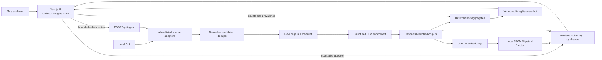

# Discovery Evidence Lab — Architecture (Artifact A)

**Last verified:** 2 July 2026
**Architecture status:** locally buildable and runnable; primary-research and public-deployment
gates remain open.

## 1. Purpose and completion decision

Discovery Evidence Lab is an evidence engine for deciding what to test in Artifact B. It collects public
Spotify feedback, applies a controlled research taxonomy, calculates deterministic aggregates,
and supports cited qualitative exploration through RAG.

It answers:

1. **What appears in this sampled corpus?** Counts by source, language, rating, theme, and
   inferred behavior segment.
2. **Why might it be happening?** Cited examples, user jobs, workarounds, counterevidence, and
   hypotheses to take into interviews.

It does not prove population prevalence or causality. Store reviews and selected Reddit threads
are self-selected feedback. Five to six interviews with active discovery seekers are still
required before treating the Artifact B concept as validated.

### Completion audit

| Capability | Verified result | Status |
|---|---|---:|
| Multi-source collection | 1,850 unique records: App Store 100, Play Store 1,200, Reddit 550 | Complete locally |
| Offline Reddit path | Seven browser-saved JSON threads accepted with `--file` and `--no-live` | Complete |
| Run manifest | Source/country/language/rating counts, date range, limitations, unique-id count | Complete |
| LLM enrichment | 1,850 records; 266 discovery-related; zero schema errors | Complete technically |
| Human label validation | 87-record audit sample prepared; labels not independently reviewed | Pending research |
| Vector retrieval | 266 real vectors, 1,536 dimensions, metadata filters and cited records | Complete locally |
| Automated RAG checks | 9/9 theme/source/scope smoke checks pass | Complete technically |
| Human RAG evaluation | Citation correctness and precision@5 need independent human scoring | Pending research |
| UI and APIs | Insights, Ask, Collect, chat, ingest, insights, and health routes | Complete locally |
| Static evidence brief | Self-contained Evidence Lab summary with no API/runtime dependency | Complete locally |
| Build and local smoke test | Clean Next.js 16 production build; core pages/APIs return 200 | Complete locally |
| Production dependency audit | `npm audit --omit=dev` reports zero vulnerabilities | Complete |
| Legacy Apple adapter | `app-store-scraper@0.18.0` retained as a local-only dev dependency | Retained by design |
| Public Vercel URL | Configuration and deployment guide exist; no public URL verified | Not deployed |
| Product decision | Intent-plus-steering concept supported as a hypothesis | Interviews required |

**Verdict:** Discovery Evidence Lab is complete as a local technical prototype and evidence-gathering
workflow. It is not complete as primary research or as a publicly deployed product. Those are
explicit gates, not hidden technical failures.

## 2. Scope

### Product users

- A PM/researcher who collects, filters, and interrogates feedback.
- An evaluator who needs every qualitative claim linked to source evidence.

### User experience

- **Collect:** run a small, allow-listed App Store or Play Store collection and see mode/status.
- **Insights:** inspect corpus coverage, ranked themes, segments, and research answers.
- **Ask:** ask a scoped question, optionally filter it, and inspect cited evidence.

### Non-goals

- No Spotify playback, Spotify authentication, or replacement recommendation engine.
- No consumer accounts or multi-tenant permissions.
- No unbounded public scraper or arbitrary target URLs.
- No claim that app reviews prove root cause, market size, or experiment impact.

### Static handoff surface

The full Next.js application remains the interactive research tool. A separate self-contained
HTML evidence brief provides the corpus, RAG findings, Smart Shuffle detail, limitations, and
Artifact B recommendation without loading OpenAI or the vector index. This is the lowest-risk
way to share Discovery Evidence Lab publicly when live chat and ingestion are not required.

## 3. Data collection architecture

The supplied store links identify Spotify's records. Collection happens through server-side
adapters, not by scraping the visible HTML pages.

| Source | Identifier/input | Active adapter | Current records |
|---|---|---|---:|
| Apple App Store | `324684580` | Apple public customer-review RSS | 100 |
| Google Play | `com.spotify.music` | `google-play-scraper` with locale pagination | 1,200 |
| Reddit | Seven allow-listed thread JSON files | Local JSON importer in `lib/reddit.mjs` | 550 |

### Why `app-store-scraper` remains

`app-store-scraper@0.18.0` has **not** been removed. It remains available through a CLI-only
Apple adapter when `APPLE_REVIEW_ADAPTER=legacy` is set. In the verified run it returned no reviews,
so the adapter automatically fell back to Apple's public RSS feed. It is a dev dependency so
its deprecated `request` dependency chain is outside the application import graph. This
preserves the requested library without making the less reliable path the default.

### Actual sampling matrix

| Source | Market/language | Records | Notes |
|---|---|---:|---|
| App Store | US; language unavailable | 100 | Recent bounded Apple RSS window |
| Play Store | US/en | 600 | Explicit country/language run |
| Play Store | IN/hi | 600 | Explicit country/language run |
| Reddit | r/truespotify | 178 | Purposefully selected threads |
| Reddit | r/LetsTalkMusic | 215 | Purposefully selected threads |
| Reddit | r/Music | 157 | Purposefully selected threads |

Date range: **10 July 2024 to 1 July 2026**. The corpus is useful for problem discovery but is
not a representative survey. Reddit was imported from the user's saved JSON because live
access is blocked on the current VPN/network.

### Collection rules

- Fixed Spotify identifiers and allow-listed Reddit inputs only.
- Stable source ids/content hashes and deduplication before enrichment.
- Explicit Play Store country/language matrix and bounded pagination.
- Partial source failures are reported and do not erase completed results.
- Author handles are not needed for analysis; retain source URLs and minimum provenance.

## 4. System architecture



### Decisions

| Decision | Choice | Reason |
|---|---|---|
| Application shape | One Next.js 16 app | Small team, one research workflow, one deployment |
| Bulk ingestion | Local CLI is source of truth | Avoid scraper blocking/function timeouts and preserve reproducibility |
| UI ingestion | Allow-listed batches capped at 100 | Provides a simple execution UI without an open crawler |
| Local storage | Inspectable JSON artifacts | Cheap and reproducible for the prototype |
| Hosted storage | Read-only committed artifacts initially; Upstash for live refresh | Vercel function files are not durable writes |
| Quantitative answers | Full-corpus deterministic aggregates | Top-k retrieval cannot establish prevalence |
| Qualitative answers | Grounded RAG with visible citations | Supports auditability and counterevidence |
| Model provider | OpenAI behind `lib/llm.mjs` | Keeps credentials server-side and provider swappable |

## 5. Pipeline and data contracts

### Reproducible local pipeline

```text
scrape stores / import saved Reddit JSON
        ↓
manifest + canonical raw reviews
        ↓
structured enrichment + checkpointing + validation
        ↓
266 discovery-related records
        ↓
embeddings + vector index ──────→ cited RAG
        ↓
deterministic aggregates ──────→ Insights
```

The main commands are:

```bash
npm run scrape
npm run scrape:reddit:offline
npm run manifest
npm run enrich
npm run audit:enrichment
npm run index
npm run insights
npm run eval:rag
npm run research
```

### Canonical review

```ts
type Review = {
  id: string;
  sourceReviewId: string | null;
  source: 'app_store' | 'play_store' | 'reddit';
  sourceType: 'review' | 'post' | 'comment';
  platform: 'ios' | 'android' | 'web';
  country: string | null;
  language: string | null;
  rating: number | null;
  title: string | null;
  text: string;
  authorHash: string | null;
  date: string | null;
  fetchedAt: string;
  appVersion: string | null;
  url: string;
  sentiment: 'positive' | 'neutral' | 'negative';
  discoveryRelated: boolean;
  frustrationThemes: string[];
  jtbd: string | null;
  segment: 'power_user' | 'casual' | 'explorer' | 'mood_based' | 'unknown';
  segmentEvidence: string | null;
  summary: string;
  tagConfidence: number;
  tagVersion: string;
};
```

Segments are model-inferred behavior labels, not demographics or verified personas.

### Serving artifacts

| Artifact | Purpose | Hosted behavior |
|---|---|---|
| `data/insights.json` | Coverage, aggregates, precomputed cited answers | Read-only |
| `data/vectors.json` | 266 local embeddings plus metadata | Read-only on Vercel |
| `data/reviews.raw.json` | Rebuildable source corpus | Local/ignored |
| `data/reviews.enriched.json` | Rebuildable tagged corpus | Local/ignored |
| `data/ingestion-manifest.json` | Run coverage and limitations | Local/ignored by current pattern |

## 6. Enrichment and research controls

The model may classify discovery relevance, sentiment, controlled themes, supported JTBDs,
behavior segments, and concise summaries. It may not determine population prevalence,
causality, or business impact.

Automated validation currently shows:

- 1,850/1,850 outputs pass the schema;
- no `non_discovery`/discovery-theme conflicts;
- an 87-record stratified audit sample is prepared;
- independent human labels remain pending.

Theme counts for the 266-record discovery subset are multi-label, so their total exceeds 266:

| Theme | Count |
|---|---:|
| Recommendations ignore taste | 72 |
| Repetitive recommendations | 70 |
| Recommendations too similar | 50 |
| Algorithm pushes popular/safe music | 49 |
| Stale Discover Weekly | 48 |
| No control over recommendations | 46 |
| Poor genre exploration | 19 |
| Autoplay loop | 14 |
| Hard to find new artists | 14 |
| UI friction | 10 |
| No explanation | 6 |

These are corpus counts, not percentages of Spotify's user base.

## 7. RAG design

### Quantitative path

Questions such as “most common,” “how many,” or “compare sources” receive aggregate context
from the full enriched corpus. An LLM can explain those returned values but cannot recompute
them from retrieved examples.

### Qualitative path

1. Check the question is within Spotify discovery/recommendation scope.
2. Apply safe source/theme/segment filters.
3. Embed with `text-embedding-3-small` using the same 1,536-dimension contract as the index.
4. Retrieve candidates, remove near-duplicates, and diversify sources where evidence exists.
5. Give numbered evidence to the synthesis model.
6. Require inline `[n]` citations and return only records actually cited.
7. Warn or refuse when the corpus cannot support the claim.

The 9/9 automated checks cover expected theme retrieval, multi-source retrieval, and off-topic
scope refusal. They are smoke tests, not a substitute for independent human relevance and
citation scoring.

## 8. API and UI surface

| Method | Route | Contract | Access |
|---|---|---|---|
| `GET` | `/` | Coverage, aggregate themes, findings, limitations | Public |
| `GET` | `/ask` | Filterable research chat UI | Public |
| `GET` | `/collect` | Bounded collection UI and storage-mode explanation | Public view |
| `POST` | `/api/chat` | Question + safe filters → answer + cited records | Rate-limited |
| `GET` | `/api/insights` | Versioned deterministic insights | Public |
| `POST` | `/api/ingest` | Allow-listed source, locale, limit ≤100 | Local/admin only |
| `GET` | `/api/health` | Data version, counts, vector/storage mode | Public; no secrets |

In production, ingestion is rejected unless an admin gate and durable remote storage are
explicitly enabled. A Vercel function must not claim that local JSON writes are durable.

## 9. Runtime modes

### Local research mode

Full collection, saved Reddit import, enrichment, indexing, evaluation, and research runs.
This is the authoritative mode for Discovery Evidence Lab.

### Read-only Vercel mode

Serve committed `vectors.json` and `insights.json`. Collect explains that a local rebuild and
redeploy are required. This is the recommended first public deployment.

### Remote refresh mode

Optional. Requires Upstash Vector, durable metadata/snapshot storage, `ALLOW_REMOTE_INGEST=true`,
an admin key, rate limits, and a hard batch cap. It is not required for the research prototype.

## 10. Security, privacy, and cost controls

- Keep `OPENAI_API_KEY` in `.env.local` or encrypted host settings; never send it to the browser.
- Rotate any key pasted into chat, logs, screenshots, or source control.
- Treat all review text as untrusted content, not instructions.
- Bound question length, output tokens, ingest size, retries, and request rate.
- Accept only known enum values and fixed app identifiers.
- Return generic client errors; do not log secrets or complete review bodies.
- `npm audit --omit=dev` is the production release check and currently passes with zero issues.
- Full `npm audit` still reports six advisories in the retained legacy `app-store-scraper`
  dependency chain. It stays local-only and outside production dependencies.

## 11. Evaluation gates

| Gate | Current result | What remains |
|---|---|---|
| Schema validity | 100% | Keep as regression test |
| Vector/data alignment | 266 vectors for 266 discovery records | Keep as regression test |
| Automated RAG checks | 9/9 pass | Expand beyond smoke coverage |
| Human enrichment quality | Sample prepared | Independently label and score precision/recall/agreement |
| Human answer quality | PM evidence review completed | Independently score precision@5 and citation correctness |
| Local release | Build and smoke tests pass | Keep as release check |
| Public release | Not attempted | Deploy, test incognito/mobile, record URL and data version |
| Product validation | Problem hypothesis defined | Interview 5–6 active discovery seekers |

## 12. Artifact B handoff

Discovery Evidence Lab supports testing an **Intent-guided Discovery Session** rather than replacing
Spotify's recommender. The proposed Artifact B combines current-session intent, novelty
control, exclusions, grounded “why this fits” explanations, and immediate steering over a
small curated catalog.

The handoff is provisional because the corpus also contains counterevidence: some people value
Discover Weekly, Release Radar, and Daylist. Artifact B should therefore test user control and
adaptation, not assume every personalized recommendation is broken.

See the root-level `docs/Artifact B Recommendation.md` for MVP scope, hypotheses, metrics, and
the interview validation gate.

## 13. Repository map

```text
artifact A/
├── docs/                 # architecture, ingestion, quickstart, deployment
├── phases/               # five execution and evidence gates
└── code/
    ├── app/              # Insights, Ask, Collect, APIs
    ├── lib/              # adapters, schema, RAG, vector and insight logic
    ├── scripts/          # collection, enrichment, indexing, eval, research
    ├── evals/            # audit samples and automated checks
    └── data/             # local corpus plus versioned serving artifacts
```

A checked technical task must be backed by a file, test result, data manifest, or deployed URL.
A product claim must also disclose the sampling and primary-research limitations.
