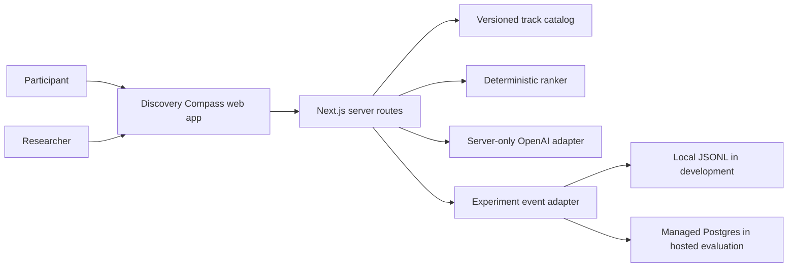
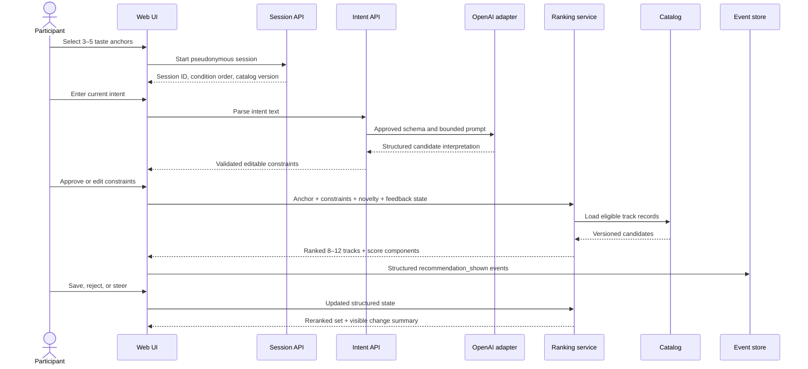

# Discovery Compass Architecture (Artifact B)

## Status

| Field | Value |
|---|---|
| Product | Discovery Compass |
| Delivery stage | Artifact B working experiment |
| Architecture status | Proposed; implementation not started |
| Evidence source | Discovery Evidence Lab, 1,850 records; 266 discovery-related |
| Primary hypothesis | Guided sessions increase accepted unfamiliar artists without reducing relevance |
| Validation prerequisite | 5–6 problem interviews before locking scope |
| Hosting target | Vercel |
| Default LLM | `gpt-4o-mini`, configurable through `DEFAULT_MODEL` |

## 1. Decision summary

Build one responsive Next.js application with five explicit boundaries:

1. A clean, versioned local catalog of 300–500 tracks.
2. A server-only AI adapter that converts flexible language into an approved schema and produces
   metadata-grounded explanations.
3. Deterministic filters and a transparent relevance, novelty, and diversity ranker.
4. Ephemeral session state plus a durable, privacy-minimized experiment event adapter.
5. Baseline and guided conditions that use the same catalog and card presentation.

Do not add Spotify authentication, audio playback, playlist writes, model training, a vector
database, or a full consumer account system. Those additions would increase delivery risk without
helping the prototype answer its primary question.

## 2. Architecture goals

- Test the session-intent and steering mechanism independently of Spotify's production systems.
- Make every recommendation reproducible from catalog version, approved intent, ranking version,
  condition, and session feedback.
- Keep exclusions, novelty, diversity, assignment, and metrics deterministic and inspectable.
- Ensure the LLM cannot invent a track, artist, catalog attribute, experiment result, or exclusion.
- Support local development and a public Vercel evaluation URL from one codebase.
- Collect enough anonymous structured evidence to compare paired sessions without storing raw
  participant intent or secrets.
- Work with keyboard, screen reader, reduced motion, 200% zoom, mobile, and desktop layouts.

## 3. System context



The participant never connects directly to OpenAI or the event database. The browser receives
only approved intent fields, ranked catalog records, explanation text, and a pseudonymous session
identifier.

## 4. Runtime components

| Component | Responsibility | Must not do |
|---|---|---|
| App shell | Taste anchor, intent editor, novelty control, cards, feedback, evaluation survey | Hold API keys or calculate experiment outcomes |
| Session service | Create session ID, assign/counterbalance conditions, hold structured state | Store identity or raw free text in analytics |
| Intent service | Call LLM, validate structured output, expose editable interpretation | Apply hidden filters or silently override user edits |
| Catalog repository | Load and validate versioned track data | Fetch an uncontrolled live catalog during a study |
| Candidate filter | Apply language, genre, artist, and session exclusions | Use LLM judgment for hard eligibility |
| Ranker | Calculate score components and choose a diverse set | Generate prose or change experiment assignment |
| Explanation service | Explain already-selected tracks from approved metadata and intent | Choose candidates or add unsupported attributes |
| Feedback reducer | Convert Save, Not for me, More like this, and More adventurous into state changes | Mutate the participant's long-term profile |
| Event adapter | Persist structured study events and derived-safe fields | Store API keys, full prompts, or raw sensitive text |
| Health endpoint | Report build, catalog, model configuration, and event-store readiness | Reveal secrets or participant event payloads |

## 5. Technology shape

### Application

- Next.js App Router with TypeScript.
- Server routes for session, intent parsing, recommendation, explanation, feedback, events, and
  health.
- React client components only where interaction or local session state requires them.
- Schema validation at catalog load, API ingress, LLM output, and event persistence boundaries.
- CSS tokens and semantic HTML; no dependency on a Spotify UI clone.

### Data and storage

- `catalog.json` is the MVP source of truth and is immutable per deployed version.
- Track IDs are stable across versions; changed metadata creates a new catalog version.
- Session UI state can remain browser-local and is sent to the server as a validated snapshot for
  ranking.
- Hosted study events use a small managed Postgres database through an `EventStore` interface.
- Local development can use an in-memory or JSONL adapter. Local files are not a hosted durability
  strategy.

### AI

- OpenAI is called only from server routes.
- `OPENAI_API_KEY` and `DEFAULT_MODEL` are server environment variables.
- Structured intent parsing and grounded explanation generation are separate calls and separate
  schemas.
- No vector database is required. At this catalog size, approved structured fields and
  deterministic scoring are sufficient; precomputed local vectors may be evaluated later behind
  a retrieval adapter if a benchmark proves a gap.

## 6. Guided-session data flow



### Baseline condition

The baseline uses the same catalog, taste anchor, card count, card layout, and event definitions.
It does not use free-text session intent, a novelty control, or iterative steering. It ranks from
the taste anchor with fixed default diversity and repeat rules. This isolates the value of the
guided mechanism instead of comparing two unrelated interfaces.

## 7. Core contracts

```ts
type Track = {
  id: string;
  title: string;
  artist: string;
  genres: string[];
  languages: string[];
  moods: string[];
  activities: string[];
  energy: number;
  valence?: number;
  era?: string;
  popularityTier?: 'niche' | 'mid' | 'popular';
  description: string;
  sourceUrl: string;
};

type ApprovedIntent = {
  activity?: string;
  moods: string[];
  genres: string[];
  languages: string[];
  energy?: number;
  novelty: number;
  excludeArtistIds: string[];
  excludeGenres: string[];
  excludeLanguages: string[];
};

type SessionState = {
  sessionId: string;
  condition: 'baseline' | 'guided';
  catalogVersion: string;
  rankingVersion: string;
  tasteAnchorIds: string[];
  approvedIntent?: ApprovedIntent;
  shownTrackIds: string[];
  savedTrackIds: string[];
  rejectedTrackIds: string[];
  boostedArtistIds: string[];
};

type RankedTrack = {
  track: Track;
  score: number;
  components: {
    intentRelevance: number;
    noveltyFit: number;
    anchorCompatibility: number;
    setDiversity: number;
    penalties: number;
  };
  noveltyLabel: 'anchor-adjacent' | 'new-relative-to-profile';
  explanation?: string;
};
```

All numeric values are finite and normalized to `0..1` at schema boundaries. Unknown fields are
rejected. The UI always allows the participant to correct AI-derived fields before ranking.

## 8. Intent parsing boundary

The AI receives only the participant's current-intent text, the allowed enum vocabulary, and the
output schema. It returns a candidate interpretation; it does not return track IDs.

Required safeguards:

- maximum input length and rate limits;
- instruction that participant text is untrusted data, not a command;
- strict structured-output validation;
- values outside the catalog vocabulary surfaced as editable unresolved terms;
- no silent fallback to fabricated genres, languages, or artists;
- deterministic defaults when the model is unavailable;
- raw intent excluded from production analytics and normal server logs.

If the parser fails, the participant can complete the same fields with direct controls. AI
failure must not end the study session.

## 9. Deterministic ranking

### Eligibility

Apply hard exclusions first. A track is ineligible if its artist, genre, or language intersects an
approved exclusion or if it violates a study fixture. Hard exclusions cannot be offset by a high
semantic or relevance score.

### Score

```text
final score =
  0.45 × intent relevance
+ 0.25 × requested novelty fit
+ 0.20 × taste-anchor compatibility
+ 0.10 × set diversity contribution
− repeat, rejection, artist-cap, and exclusion penalties
```

Weights are versioned defaults, not learned truth. Every response includes component scores in
development mode and logs their bounded values in evaluation mode.

### Set selection

1. Sort eligible candidates by base score with a seeded tie-breaker.
2. Select 8–12 tracks while enforcing a default maximum of two tracks per artist.
3. Prefer incremental genre/artist diversity when scores are close.
4. Suppress tracks already shown unless the participant explicitly requests more like one.
5. Never label a track “new to you”; use “new relative to your selected profile.”

The random seed derives from a server-created session seed, condition, ranking version, and
iteration. This permits replay without exposing predictable global ordering.

## 10. Grounded explanations

Candidate selection happens before explanation generation. The explanation service receives one
selected track record and the approved intent. Its output is one short sentence and must only
reference supplied fields.

Validation rules:

- selected track ID and artist cannot change;
- no unsupported facts, popularity claims, or knowledge of listening history;
- maximum sentence and character length;
- fallback deterministic template when AI is unavailable or validation fails;
- explanation helpfulness measured separately from ranking acceptance.

Batching explanations for one set is allowed to reduce latency and cost, but each returned item
must be keyed by an allowed selected track ID.

## 11. Feedback state machine

| Action | Deterministic state change | Visible confirmation |
|---|---|---|
| Save | Add track to saved set; no automatic overfitting | “Saved for this study session.” |
| Not for me | Reject track and suppress artist/close attributes for the next iteration | “Avoided this track and reduced close matches.” |
| More like this | Boost approved attributes and artist neighborhood within caps | “Kept these traits while preserving variety.” |
| More adventurous | Increase novelty by a fixed step up to 1.0 | “Increased novelty; other approved constraints stayed fixed.” |

Each action creates an immutable event, then derives new `SessionState`. State reducers are pure
functions so they can be replayed and unit tested.

## 12. Server API

| Route | Method | Purpose | Important response |
|---|---|---|---|
| `/api/health` | GET | Deployment readiness | build, catalog version/count, model configured, event store ready |
| `/api/session` | POST | Start session and assign order | session ID, seed token, first condition, versions |
| `/api/intent/parse` | POST | Parse guided intent | validated editable `ApprovedIntent` candidate and unresolved terms |
| `/api/recommendations` | POST | Filter, rank, select, and explain | ranked set, change summary, version metadata |
| `/api/feedback` | POST | Validate action and return next state/set | updated state digest and reranked cards |
| `/api/events` | POST | Persist allowed structured events | accepted event IDs |
| `/api/session/complete` | POST | Record survey and condition completion | next condition or study completion |

Every mutating route validates body size, schema, session token, catalog version, and rate limit.
API errors use stable codes so the UI can recover without showing raw server details.

## 13. Experiment and event model

### Condition order

Use a server-assigned, balanced order: half of participant sessions receive baseline then guided;
the other half receive guided then baseline. A participant uses the same taste anchor across both.

### Allowed event envelope

```ts
type StudyEvent = {
  eventId: string;
  sessionId: string;
  eventName:
    | 'session_started'
    | 'anchor_approved'
    | 'intent_parsed'
    | 'intent_edited'
    | 'recommendations_shown'
    | 'track_saved'
    | 'track_rejected'
    | 'refinement_requested'
    | 'condition_completed'
    | 'study_completed';
  condition: 'baseline' | 'guided';
  iteration: number;
  catalogVersion: string;
  rankingVersion: string;
  modelVersion?: string;
  properties: Record<string, string | number | boolean | string[]>;
  occurredAt: string;
};
```

The server uses an allowlist per event name. It rejects unknown properties. Track IDs, derived
scores, edits-made booleans, action counts, elapsed time, and survey ratings are allowed. Names,
email addresses, IP addresses, raw prompts, full user agents, and API inputs are not study fields.

### Primary metric

```text
accepted novel artist rate =
saved tracks whose artist is absent from the selected taste anchor
÷ all recommendation cards shown
```

Also calculate overall acceptance, first-set acceptance, post-refinement acceptance, unique
artist/genre ratio, repeat exposure, intent edit rate, time/actions to first save, and participant
ratings for relevance, novelty, control, and explanation helpfulness.

## 14. Privacy and security

- Keep `OPENAI_API_KEY` server-only and out of client bundles, source control, logs, and event data.
- Rotate any key that has appeared in chat, screenshots, terminal history, or committed files.
- Use pseudonymous random session IDs; do not collect account identity for the MVP.
- Do not persist raw current-intent text in the hosted event store.
- Validate URLs in the curated catalog during build; only render approved `https` source links.
- Add rate limits to AI and event routes and a global per-session cost ceiling.
- Escape rendered text; never render LLM output as HTML.
- Use same-origin APIs, restrictive security headers, and no third-party analytics by default.
- Publish a short study notice explaining data fields, retention, and deletion timing.
- Set a bounded event-retention period and delete test sessions before real evaluation.

## 15. Reliability and failure behavior

| Failure | User behavior | Research behavior |
|---|---|---|
| OpenAI unavailable | Direct controls remain usable; template explanation | Log structured service failure, not prompt text |
| Parser output invalid | Show editable defaults and unresolved terms | Increment parser failure diagnostic |
| Catalog invalid | Fail build/startup; do not run study | Health endpoint reports not ready |
| Event store unavailable | Keep session usable and retry bounded queue | Mark study data incomplete; do not claim a valid session |
| Too few eligible candidates | Explain constraint conflict and allow edits | Log candidate count and active exclusions |
| Explanation invalid | Use deterministic template | Record fallback reason |
| Version mismatch | Ask client to refresh before continuing | Prevent mixed-version metrics |

## 16. Observability

- Structured server logs with request ID, route, latency, status, and safe error code.
- No raw prompt, API key, database URL, or participant-entered text in logs.
- Health check reports catalog count/version, ranker version, event adapter, and AI configuration.
- Measure parser latency/failure, recommendation latency, candidate counts, explanation fallback,
  event persistence errors, and cost per completed guided condition.
- Maintain a replay command that reconstructs ranking from redacted session fixtures.

## 17. Testing strategy

### Unit

- catalog schema, unique IDs, URLs, numeric bounds, and coverage thresholds;
- intent schema and defaults;
- hard exclusions, score components, artist caps, seed determinism, and feedback reducers;
- metric calculations and event allowlists.

### Contract

- route request/response fixtures;
- invalid or malicious AI output rejection;
- explanation grounding against selected track metadata;
- event adapter behavior in local and hosted modes.

### Golden AI evaluation

Maintain 25–40 representative intent phrases including ambiguity, negation, mixed languages,
prompt injection, impossible constraints, and very short input. Human-approved structured outputs
form the regression set; semantic flexibility is allowed only inside approved fields.

### End-to-end

- complete baseline and guided conditions in both orders;
- edit parsed intent, change novelty, exclude an artist, reject, save, and finish survey;
- keyboard-only flow, focus visibility, narrow viewport, 200% zoom, and reduced motion;
- OpenAI and event-store failure fallbacks;
- no secret or raw-intent leakage in browser network payloads outside the parse request.

## 18. Deployment modes

| Mode | Catalog | AI | Events | Purpose |
|---|---|---|---|---|
| Local demo | bundled JSON | optional or mocked | memory/JSONL | development and deterministic tests |
| Preview | bundled JSON | configured server-side | isolated test adapter/database | review and usability testing |
| Evaluation | immutable bundled JSON | configured server-side | durable Postgres | paired participant study |

Vercel environment variables are configured by environment. Preview and evaluation data must not
share a database namespace. Deployment fails its smoke gate if the catalog is invalid, the health
route is not ready, or an evaluation deployment lacks durable event storage.

## 19. Proposed code layout

```text
artifact B/
  code/
    app/
      api/
        events/
        feedback/
        health/
        intent/parse/
        recommendations/
        session/
      study/
      page.tsx
    components/
    data/
      catalog.json
      catalog.manifest.json
    lib/
      ai/
      catalog/
      events/
      experiment/
      ranking/
      schemas/
      session/
    tests/
      contract/
      e2e/
      fixtures/
      golden/
      unit/
  docs/
  phases/
```

The existing `code/static/` Discovery Evidence Lab summary remains a research handoff asset. It
is not part of the Discovery Compass runtime.

## 20. Architecture decisions

| ID | Decision | Reason |
|---|---|---|
| ADR-001 | Use a curated local catalog | Controls quality and makes baseline/guided comparison reproducible |
| ADR-002 | No Spotify integration in the MVP | Authentication and playback do not test the session-intent mechanism |
| ADR-003 | Keep ranking deterministic | Makes exclusions enforceable and failures diagnosable |
| ADR-004 | Use AI only for language parsing/refinement/explanation | Flexible language benefits from AI; experiment logic does not |
| ADR-005 | No vector database initially | 300–500 structured records do not justify operational complexity |
| ADR-006 | Use an event-store adapter with durable hosted storage | Local simplicity without false Vercel persistence assumptions |
| ADR-007 | Compare paired baseline and guided conditions | Reduces between-person taste variance in a small directional study |
| ADR-008 | Do not log raw intent | The metric requires structured outcomes, not participant prose |

## 21. Open decisions before build lock

1. Do interviews validate current-session intent as a leading mechanism?
2. Which 2–3 catalog genres/languages provide enough breadth without pretending full coverage?
3. What constitutes a taste anchor: artists, genres, or a prepared mixed profile?
4. Will a participant save/shortlist without audio, or is an approved preview necessary?
5. What study retention period and participant notice are appropriate?
6. Which managed Postgres account is available for evaluation deployment?

## 22. Architecture definition of done

The architecture is implemented when:

- the same catalog and cards support both conditions;
- catalog, intent, LLM output, session, and event schemas reject invalid data;
- ranking is deterministic, versioned, replayable, and covered by fixtures;
- exclusions and feedback visibly change the next set;
- every explanation is grounded or replaced by a safe template;
- all primary and guardrail metrics can be calculated from allowed events;
- the Vercel evaluation deployment has durable event storage and passes desktop/mobile smoke tests;
- the client and logs contain no OpenAI key or persisted raw participant intent;
- the study report separates observations, directional results, and unresolved hypotheses.

See the [five phase plans](README.md) for the delivery sequence and exit gates.
