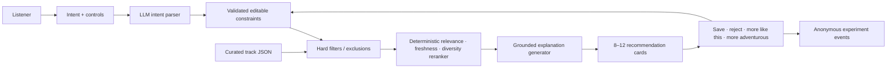

# Artifact B Recommendation — Discovery Compass

## Product decision

Build **Discovery Compass**, an intent-guided music discovery prototype for active discovery
seekers. It should test whether a listener gets more acceptable freshness when they can state what
they want **now**, choose how adventurous the results should be, exclude unwanted directions,
and steer the next set immediately.

Do not build a clone of Spotify, a general chat assistant, or a replacement recommender. The
prototype should isolate one unvalidated product hypothesis from Discovery Evidence Lab
(Artifact A):

> A lightweight layer of session intent and steering can correct the mismatch between a
> persistent taste profile and what an active discovery seeker wants in the current moment.

## Why this is the right next experiment

Discovery Evidence Lab found 266 discovery-related records in a purposefully sampled
1,850-record corpus.
The leading tagged themes were ignored taste (72), repetition (70), overly similar results (50),
popular/safe bias (49), stale Discover Weekly (48), and missing controls (46).

The qualitative evidence adds an important mechanism:

- people with large libraries still report a narrow recurring rotation;
- temporary contexts can contaminate a persistent recommendation profile;
- users request a familiar-versus-pure-discovery control and exclusions;
- some users improve discovery by deliberately managing their input signals;
- Discover Weekly, Release Radar, and Daylist work well for some users.

That counterevidence means the opportunity is to **augment and steer** a recommender, not declare
that personalization itself is broken.

## How the solution maps to the problem

| Evidence Lab finding | Artifact B response | Expected effect |
|---|---|---|
| Persistent history does not represent current intent | Natural-language session intent with editable constraints | Make mood, activity, genre, language, and energy explicit |
| Familiar and overly similar results recur | Freshness control, repeat penalties, artist caps, and set-diversity scoring | Increase experienced variety without forcing randomness |
| Users want exclusions and profile repair | Session exclusions for artists, genres, languages, and unwanted directions | Prevent known bad inputs from shaping the current set |
| Feedback feels weak or invisible | Immediate reranking and a plain-language “what changed” status | Show that steering has a direct effect |
| Explanations may improve trust, but evidence is thin | One metadata-grounded explanation per selected track | Test explanation separately from recommendation quality |

The full evidence-to-solution rationale and rejected alternatives are recorded in
[Solutioning.md](Solutioning.md).

### Why AI belongs in the solution

AI handles flexible language: parsing intent, interpreting conversational refinement, and
expressing a grounded fit explanation. Hard filters, freshness, repeat suppression, diversity,
ranking inputs, experiment assignment, and metrics remain deterministic. This boundary makes the
AI useful without allowing it to invent music or hide product behavior.

## Target user and job

### Primary segment

An **active discovery seeker** who:

- listens often and has recognisable music preferences;
- intentionally tries to find unfamiliar artists or sounds;
- notices repetition and recommendation drift;
- currently skips, manually manages playlists, or uses external discovery sources.

Power users are a useful recruiting pool, but “power user” is not a demographic persona and
should not be hard-coded into the product.

### Job to be done

> When I want music beyond my current rotation, help me find unfamiliar options that fit what I
> want right now, so I can explore without losing relevance or training my long-term profile by
> trial and error.

## Core prototype experience

### 1. Establish a lightweight taste anchor

For the prototype, let the user pick 3–5 artists/genres they generally like or choose a prepared
sample profile. Do not require Spotify authentication.

### 2. Capture current intent

Use one natural-language input, for example:

> Hindi indie for late-night focus; warm vocals, low energy, mostly artists I do not know.

The AI converts it into editable structured constraints:

```json
{
  "activity": "focus",
  "moods": ["calm", "warm"],
  "genres": ["indie"],
  "languages": ["hi"],
  "energy": 0.3,
  "freshness": 0.8,
  "excludeArtists": [],
  "excludeGenres": []
}
```

The user should be able to correct the interpretation before generating results.

### 3. Choose freshness visibly

Provide one clear control:

```text
Familiar-adjacent ───────── Balanced ───────── Adventurous
```

Freshness must affect the ranking, not just the explanation. Define it relative to the selected
taste anchor and prior results in the current session.

### 4. Show a small recommendation set

Return 8–12 cards from a curated catalog. Each card includes:

- song and artist metadata;
- whether the artist/genre is new relative to the prototype profile;
- one short, evidence-grounded “why it fits” sentence;
- `Save`, `Not for me`, `More like this`, and `More adventurous` actions.

No audio playback is required. A 30-second preview link may be added only if it comes from a
licensed/public catalog source and is not needed to validate the interaction.

### 5. Adapt immediately

When the user gives feedback, regenerate or rerank the remaining set and display what changed:

- “Avoided this artist and close matches.”
- “Increased freshness while keeping low energy.”
- “Kept Hindi vocals; widened genre from indie to folk/electronic.”

This visible cause-and-effect is more important than a long conversational response.

## MVP scope

### Must have

1. A curated local JSON catalog of roughly 300–500 tracks with consistent metadata.
2. A lightweight taste-anchor step.
3. Natural-language intent parsing into an editable schema.
4. Freshness control and artist/genre/language exclusions.
5. Candidate retrieval plus relevance/freshness/diversity reranking.
6. Eight to twelve recommendation cards with grounded explanations.
7. Immediate feedback actions and session-state adaptation.
8. A baseline mode for evaluating the guided experience.
9. Event logging without sensitive text or secrets.
10. A Vercel-deployable responsive interface.

### Explicit non-goals

- Spotify login, playlist writes, playback, or production Spotify API integration.
- Training a recommendation model.
- A full catalog, social network, or persistent consumer account.
- Claims that the prototype knows the user's true taste.
- A multilingual-first positioning before interviews validate that need.

## What AI should and should not do

### Use AI for

- parsing free-text intent into the approved schema;
- identifying soft constraints and ambiguity;
- generating a short explanation from candidate metadata and the parsed intent;
- interpreting feedback such as “less dreamy, more rhythmic” into constraint changes;
- supporting a conversational refinement when direct controls are insufficient.

### Use deterministic logic for

- hard exclusions and eligibility filters;
- freshness calculations;
- duplicate/artist caps;
- diversity constraints;
- final scoring inputs and metric calculations;
- experiment assignment and analytics events.

The LLM should not invent tracks, artists, attributes, or catalog facts. Every explanation must
be grounded in fields from the selected catalog record and the user's approved intent.

## Suggested ranking design

For each eligible candidate, calculate a transparent score:

```text
final score =
  0.45 × intent relevance
+ 0.25 × requested freshness fit
+ 0.20 × taste-anchor compatibility
+ 0.10 × set diversity
− repeat/artist/exclusion penalties
```

The exact weights are prototype defaults, not learned truth. Log score components so the team
can diagnose whether users reject relevance, freshness, or diversity.

Freshness can be estimated from:

- whether the artist appeared in the taste anchor or session history;
- semantic distance from anchor genres/attributes;
- popularity tier if the curated data contains a reliable value;
- repeated exposure within the prototype session.

Do not call a track “new to the user” unless the prototype has enough profile/history evidence;
use “new relative to your selected profile” instead.

## Catalog contract

```ts
type Track = {
  id: string;
  title: string;
  artist: string;
  genres: string[];
  languages: string[];
  moods: string[];
  activities: string[];
  energy: number;          // 0..1, curated/derived consistently
  valence?: number;        // optional 0..1
  era?: string;
  popularityTier?: 'niche' | 'mid' | 'popular';
  description: string;     // factual attributes used for retrieval/explanation
  sourceUrl: string;
};
```

Use only fields that are consistently populated. A smaller clean catalog is better than a large
catalog with invented or noisy metadata.

## Product architecture



Recommended stack: one Next.js app on Vercel, OpenAI called only from server routes, local
curated catalog for the MVP, and a small durable event store for evaluation. No vector database
is necessary until the catalog or retrieval benchmark justifies one; in-memory embeddings or
precomputed vectors are sufficient for 300–500 tracks.

## Experiment design

### Primary hypothesis

Active discovery seekers using session intent plus steering will accept more unfamiliar artists
than users receiving an unsteered list, without reducing perceived relevance.

### Baseline

Generate from the same taste anchor and catalog but do not use the free-text session intent,
freshness control, or iterative feedback. Keep list size and card design otherwise consistent.

### Primary metric

**Accepted fresh artist rate**

```text
saved/shortlisted tracks from artists absent from the selected taste anchor
÷ all recommendation cards shown
```

This is a prototype proxy, not a streaming outcome.

### Guardrail and diagnostic metrics

| Metric | What it tests |
|---|---|
| Overall card acceptance rate | Relevance is not sacrificed for freshness |
| First-set acceptance | Initial intent interpretation quality |
| Acceptance after refinement | Whether steering actually repairs the set |
| Unique artist/genre ratio | Experienced diversity |
| Repeat exposure rate | Whether the prototype recreates the original loop |
| Intent edit rate | Parser misunderstanding or useful transparency |
| Time/actions to first accepted result | Discovery effort |
| 1–5 relevance, freshness, and control ratings | Perceived outcome and mechanism |
| Explanation helpfulness | Whether explanation adds trust beyond ranking |

### Qualitative success signal

Participants can explain how their input changed the recommendations and say the set feels both
new and appropriate for the current context.

## Validation sequence

### Gate 0 — interviews before locking scope

Interview 5–6 active discovery seekers using the questions in `RAG Questions.md`. Confirm:

- the last real discovery failure and current workaround;
- whether current-session intent is actually missing;
- which control matters most;
- tolerance for one short setup step;
- what “new” and “relevant” mean to that listener.

If interviews show that playback repetition or poor base catalog retrieval dominates, change the
prototype rather than forcing this concept.

### Gate 1 — concept/usability test

Test a clickable version with 5 participants. Success means at least 4 can create an intent,
understand freshness, correct the parsed constraints, and refine results without explanation.

### Gate 2 — working prototype test

Run at least 10 paired sessions (baseline and guided, counterbalanced). Compare accepted fresh
artist rate, relevance rating, and effort. The sample is directional, not statistically powered.

### Gate 3 — decide

- **Continue:** freshness acceptance improves and relevance/control do not decline.
- **Iterate:** users value control but the parser/ranking fails in identifiable ways.
- **Stop/pivot:** setup feels like work, users cannot distinguish the result, or base candidate
  quality dominates the experience.

## Five build phases

1. **Catalog and measurement:** clean track schema, taste anchors, baseline, event definitions.
2. **Intent layer:** schema, LLM parser, validation, editable interpretation, failure states.
3. **Ranking:** filters, freshness/relevance/diversity scoring, deterministic test fixtures.
4. **Experience:** cards, explanations, feedback loop, responsive UI, accessibility.
5. **Evaluation and deploy:** paired test flow, analytics, safety/cost checks, Vercel smoke test.

The implementation-ready documents are:

- [Discovery Compass architecture](../artifact-b/docs/architecture.md)
- [Phase 1: Validate, Catalog, and Measure](../artifact-b/phases/phase_1.md)
- [Phase 2: Intent Layer and Editable Interpretation](../artifact-b/phases/phase_2.md)
- [Phase 3: Deterministic Retrieval, Freshness, and Diversity](../artifact-b/phases/phase_3.md)
- [Phase 4: Recommendation Experience and Immediate Steering](../artifact-b/phases/phase_4.md)
- [Phase 5: Evaluate, Deploy, and Decide](../artifact-b/phases/phase_5.md)

## Key risks and mitigations

| Risk | Mitigation |
|---|---|
| The corpus overrepresents power-user complaints | Recruit casual/counterexample participants too |
| Intent entry adds friction | One prompt, defaults, example intents, editable chips |
| Explanations decorate bad results | Measure ranking first and explanation helpfulness separately |
| “Fresh” is falsely claimed | Phrase freshness relative to selected profile/session evidence |
| LLM invents catalog facts | Select candidates first; generate only from structured metadata |
| Small catalog limits relevance | Disclose coverage and test interaction mechanics, not catalog breadth |
| Multilingual scope dilutes the MVP | Support language metadata, but position it only after validation |
| Prototype cannot prove streaming impact | Use honest save/shortlist and survey proxies |

## Definition of done

Artifact B is ready for evaluation when:

- the same catalog supports both baseline and guided conditions;
- intent parsing is schema-validated and user-correctable;
- exclusions, freshness, and feedback visibly alter ranking;
- every recommendation and explanation maps to a real catalog item;
- experiment events calculate the primary and guardrail metrics;
- the product works on mobile and desktop from one public URL;
- no OpenAI key or sensitive free-text content reaches logs/client bundles;
- the final report distinguishes observed outcomes from hypotheses.

## One-sentence pitch

> Discovery Compass helps active music explorers describe what they want now, control how far
> to venture beyond familiar taste, and immediately steer a small set of explainable new-music
> suggestions.
